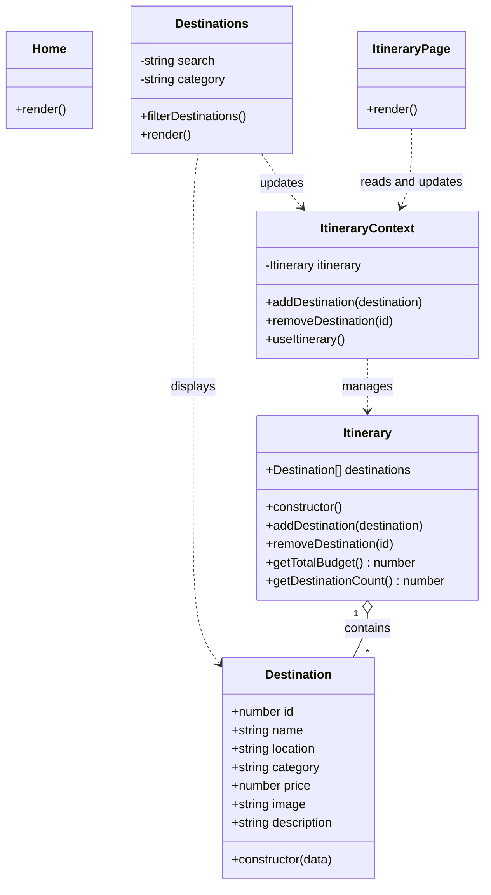

# Lakbay Travel Planner — Class Diagram

```mermaid
classDiagram
    class Destination {
        +number id
        +string name
        +string location
        +string category
        +number price
        +string image
        +string description
        +constructor(data)
    }

    class Itinerary {
        +Destination[] destinations
        +constructor()
        +addDestination(destination)
        +removeDestination(id)
        +getTotalBudget() number
        +getDestinationCount() number
    }

    class ItineraryContext {
        -Itinerary itinerary
        +addDestination(destination)
        +removeDestination(id)
        +useItinerary()
    }

    class Home {
        +render()
    }

    class Destinations {
        -string search
        -string category
        +filterDestinations()
        +render()
    }

    class ItineraryPage {
        +render()
    }

    Itinerary "1" o-- "*" Destination : contains
    ItineraryContext ..> Itinerary : manages
    Destinations ..> Destination : displays
    Destinations ..> ItineraryContext : updates
    ItineraryPage ..> ItineraryContext : reads and updates
```
